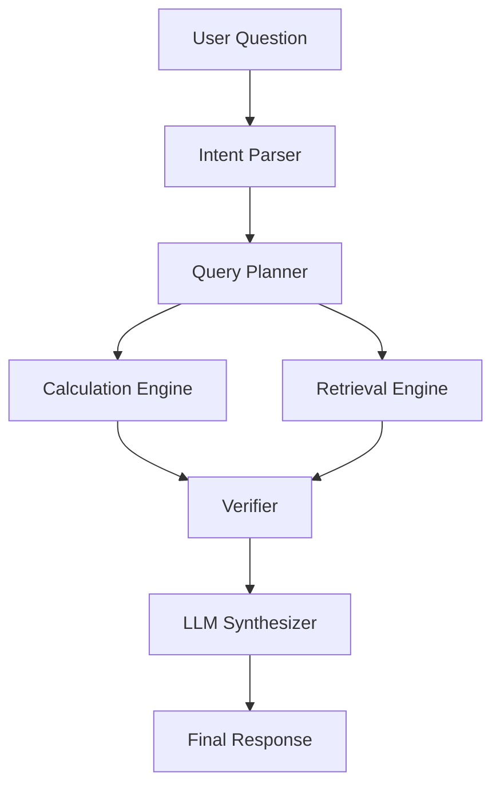

# Financial Research Assistant with Numerical Verification

## 1. Problem
Financial reporting questions are easy to answer poorly with a normal LLM because the model may invent numbers, estimate ratios, or mix narrative and spreadsheet values. In a finance workflow, that is not acceptable.

## 2. Solution
This project uses a verified RAG pattern:

- Python and Pandas calculate the financial numbers from CSV data.
- TF-IDF retrieval pulls relevant narrative evidence from reports.
- A verifier checks that the narrative lines up with the calculated values.
- The LLM only synthesizes a natural-language answer from verified numbers and citations.

## 3. Why normal LLM/RAG can hallucinate financial numbers
LLMs are great at language, but not guaranteed to preserve the exact arithmetic in multi-step financial questions. If asked to infer a ratio or compare years, they may rely on priors rather than evidence. This is why the application treats the calculation engine as the source of truth.

## 4. Verified RAG architecture
The backend follows a simple pipeline:

- User question
- Intent parser
- Query planner
- Calculation engine
- Retrieval engine
- Verifier
- LLM synthesizer
- API response

## 5. Architecture diagram using Mermaid



## 6. Project structure

```text
fin_rag_assistant/
  data/
  ingestion/
  retrieval/
  calculations/
  qa/
  models/
  evaluation/
  api/
  tests/
  config.py
  main.py
requirements.txt
.env.example
README.md
```

## 7. Installation

```bash
python -m venv .venv
.venv\Scripts\activate
pip install -r requirements.txt
```

## 8. Environment setup
Copy the example environment file and fill in any keys:

```bash
copy .env.example .env
```

Example values:

```env
GROQ_API_KEY=your_groq_api_key_here
GROQ_MODEL=llama-3.3-70b-versatile
GROQ_TIMEOUT_SECONDS=20
DEBUG=false
```

Keep the real key in `.env`, not `.env.example`. The application loads `.env` and falls back to its deterministic verified response when the key is missing or the Groq request fails.

Groq is used only to write the final wording from verified calculations and retrieved citations. Python remains the source of truth for financial values.

## 9. Running the backend

```bash
python main.py
```

For the API:

```bash
uvicorn fin_rag_assistant.api.server:app --reload
```

## 10. Running tests

```bash
pytest -q
```

## 11. Example API request

```bash
curl -X POST http://127.0.0.1:8000/ask \
  -H "Content-Type: application/json" \
  -d '{"question":"Why did gross margin fall in 2024?","company":"Acme Retail Inc.","year":2024}'
```

## 12. Example API response

```json
{
  "answer": "Gross margin fell from 35.2% to 33.8% ...",
  "calculations": [{"metric": "gross_margin", "value": 33.8, "unit": "%"}],
  "citations": [{"chunk_id": "...", "section": "MD&A"}],
  "warnings": [],
  "status": "success"
}
```

## 13. Golden test results
The project keeps a verification-oriented goldens set and checks the numeric output rather than only the generated wording.

## 14. Limitations
- Retrieval is simple TF-IDF, not a vector database.
- The app uses a deterministic fallback when no LLM key is present.
- Contradiction detection is lightweight and rule-driven.

## 15. Future improvements
- Add more financial metrics and richer company data.
- Expand the golden set to a broader product catalog.
- Add a proper frontend rendering layer for charts and citations.

## Why the architecture matters
RAG retrieves narrative evidence. Python calculates financial numbers. The verifier checks consistency. The LLM only synthesizes the final explanation.
